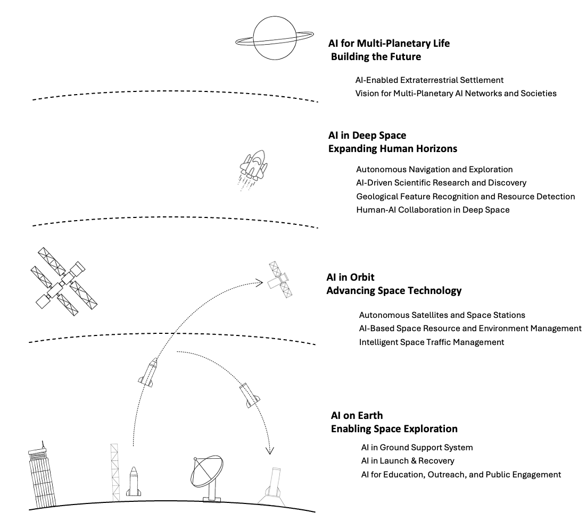

<div align="center">
<h1> Space AI: Leveraging Artificial Intelligence for Space to Improve Life on Earth </h1>

[](https://arxiv.org/abs/2512.22399)
[](https://github.com/ziyangwang007/Space-AI/commits/main/)
[](http://makeapullrequest.com) 
[](https://github.com/sindresorhus/awesome)

</div>

---

**Author:**  
[Ziyang Wang](https://www.zywang.site) 
📧 Email: ziyangwang@ieee.org
---



---


A **curated list of awesome papers on Space AI**, accompanying the survey:

> **Space AI: Leveraging Artificial Intelligence for Space to Improve Life on Earth**  
> *arXiv:2512.22399*

This repository aims to systematically organize research on **AI4Space**.

We intend to **regularly update** this repository with the latest papers, systems, and surveys.  
We strongly encourage researchers to **submit pull requests**, open issues, or contact us to add new work.

---

## Citation

If you find this repository or the survey useful, please cite:

```bibtex
@article{wang2025spaceai,
  title   = {Space AI: Leveraging Artificial Intelligence for Space to Improve Life on Earth},
  author  = {Wang, Ziyang},
  journal = {arXiv preprint arXiv:2512.22399},
  year    = {2025}
}
```
---
## Overview

- [News](#news)
- [Survey & Vision Papers](#survey--vision-papers)
- [AI on Earth: Enabling Space Exploration](#part-i--ai-on-earth-enabling-space-exploration)
- [AI in Orbit: Advancing Space Technology](#part-ii--ai-in-orbit-advancing-space-technology)
- [AI in Deep Space: Expanding Human Horizons](#part-iii--ai-in-deep-space-expanding-human-horizons)
- [AI for Multi-Planetary Life: Building the Future](#part-iv--ai-for-multi-planetary-life-building-the-future)
- [Datasets & Benchmarks](#datasets--benchmarks)


## News

- **[XXXX-XX-XX]** 🚀 XXXX.  
- **[XXXX-XX-XX]** 📄 XXXX.

---

## Survey & Vision Papers

**XXXX.** [XXXX].  
*XXXX.*  
[[PDF]]

**XXXX.** [XXXX].  
*XXXX.*  
[[PDF]]

---

## AI on Earth: Enabling Space Exploration

AI developed on Earth to support space missions, data processing, and decision-making.

**XXXX.** [XXXX].  
*XXXX.*  
[[PDF]] [[Code]]

**XXXX.** [XXXX].  
*XXXX.*  
[[PDF]]

---

## AI in Orbit: Advancing Space Technology

AI systems deployed onboard spacecraft and satellites, operating under resource and safety constraints.

**XXXX.** [XXXX].  
*XXXX.*  
[[PDF]] [[Code]]

**XXXX.** [XXXX].  
*XXXX.*  
[[PDF]]

---

## AI in Deep Space: Expanding Human Horizons

AI for deep-space exploration, operating under long delays and extreme uncertainty.

**XXXX.** [XXXX].  
*XXXX.*  
[[PDF]]

**XXXX.** [XXXX].  
*XXXX.*  
[[PDF]]

---

## AI for Multi-Planetary Life: Building the Future

AI as a foundation for long-term human and robotic presence beyond Earth.

**XXXX.** [XXXX].  
*XXXX.*  
[[PDF]]

**XXXX.** [XXXX].  
*XXXX.*  
[[PDF]]

---

## Datasets & Benchmarks

**XXXX.** Dataset name.  
*XXXX.*  
[[Paper]] [[Dataset]]

**XXXX.** Dataset name.  
*XXXX.*  
[[Paper]] [[Dataset]]

